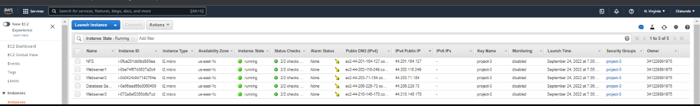
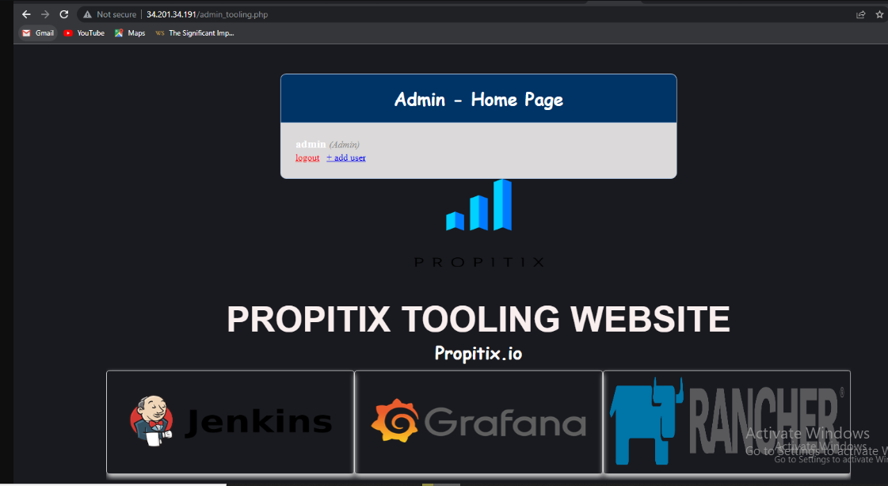
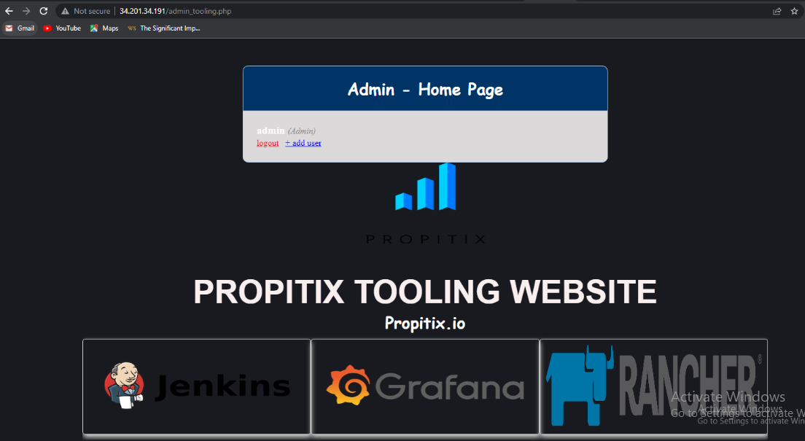

#PECTOR DOCUMENTATION FOR PROJECT 7
- Recall from the documentation 'In previous (Project 6) you implemented a WordPress based solution that is ready to be filled with content and can be used as a full fledged website or blog.
In this project, I first of all created 4 Instances, nfs, two (2) web server and a db servers. The webserver was created using Red Hat while Database server was create on Ubutu 20.04 
Based on your LVM experience from Project 6, I Configure LVM on the Server. Instead of formating the disks as ext4 you will have to format them as xfs. Ensure there are 3 Logical Volumes. `lv-opt` `lv-apps`, and `lv-logs` Create mount points on /mnt directory for the logical volumes as follow: `Mount lv-apps` on `/mnt/apps` – To be used by webservers `Mount lv-logs` on `/mnt/logs` – To be used by webserver logs
`Mount lv-opt` on `/mnt/opt` – To be used by Jenkins server in Project 8
 I Install NFS server, configure it to start using this commands `sudo yum -y update` `sudo yum install nfs-utils -y` `sudo systemctl start nfs-server.service` `sudo systemctl enable nfs-server.service` `sudo systemctl status nfs-server.service`
 , I later configured my security group 
 - I later configure my Database server and installed mySql , On the webservers created, I ran `sudo yum install nfs-utils nfs4-acl-tools -y` crreated a directory, mounted `/var/www` with `sudo mount -t nfs -o rw,nosuid` <NFS-Server-Private-IP-Address>:/mnt/apps /var/www using NFS Private IP. After installing apache and php in Remi's repository for the three servers
, 
- First Webserver ,
 - second webserver ,
  - third webserver, 
  - Database server 
  I verified if Apache files and directories were available on the Web Server in `/var/www` and also on the NFS server in `/mnt/apps` then I located the log folder for Apache on the Web Server and mounted it to NFS server’s export for logs. i forked the tooling source code gottten from Darey.io Tooling... learn how i did it here afer which git clloned the files 
  I also deployed the html folder from the repository to /var/www/html and accessed the page using the webservers IP addresses , 
  - on webserver 1 
  - on webserver 2 

  Thank You!